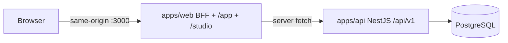
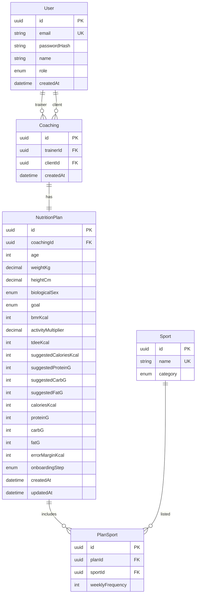

# SDD — Software Design Document

**Produto:** Zenith  
**Autores:** Allan Roberto Cordova de Campos  
**Origem:** [prd.md](./prd.md)

Documento de design: arquitetura, diagrama ER em Mermaid e DTOs.

---

## 1. Arquitetura

| Decisão | Escolha |
| --- | --- |
| Organização | Monorepo `apps/api` + `apps/web` |
| API | NestJS + TypeScript |
| Web | Next.js (App Router), PWA |
| Banco | PostgreSQL + Prisma |
| Auth | JWT access (~15m) + refresh (~7d); BFF Next (`app/api/v1/auth/*`); cookies `httpOnly` `zenith_access` / `zenith_refresh` |
| Gate web | `proxy.ts` (Next.js 16) em `/`, `/login`, `/register`, `/app`, `/studio` |
| Qualidade | TDD com Jest + CI (GitHub Actions) |

Duas interfaces no mesmo front, isoladas por papel do usuário:

- `/app` — aluno (`CLIENT`)
- `/studio` — treinador (`TRAINER`)



O browser não chama `:3001`. `proxy.ts` lê o payload JWT sem verificar assinatura; o Nest `JwtAuthGuard` autoriza `/auth/me`.

---

## 2. Diagrama ER



`role`: `TRAINER` | `CLIENT`.

**Coaching** — vínculo 1:N treinador→alunos. `trainerId` e `clientId` apontam para `User`. Único `(trainerId, clientId)`. O treinador não vincula a si mesmo. `clientId` deve ter `role = CLIENT`.

**Sport** — catálogo seed. `category`: `STRENGTH` | `CARDIO` | `SPORT`.

**NutritionPlan** — um plano vigente por `Coaching` (`coachingId` único). Campos antropométricos, `goal` e sugestões do motor podem ser nulos até o wizard avançar. `biologicalSex`: `MALE` | `FEMALE`. `goal`: `FAT_LOSS` | `HYPERTROPHY` | `MAINTENANCE`. `onboardingStep`: `ANTHROPOMETRICS` | `ROUTINE` | `GOAL` | `ENGINE` | `FINE_TUNE` | `COMPLETE`. Fórmulas em [prd.md §4](./prd.md). `errorMarginKcal` só existe na API do treinador.

**PlanSport** — esportes do plano com frequência 1–14 sessões/semana. Único `(planId, sportId)`.

---

## 3. DTOs

### 3.1 Autenticação (`US-AS0`)

`UserResponseDto` nunca inclui `passwordHash` nem tokens.

```ts
export class RegisterUserDto {
  name: string;
  email: string;
  password: string;
  role: 'TRAINER' | 'CLIENT';
}

export class LoginDto {
  email: string;
  password: string;
}

export class RefreshTokenDto {
  refreshToken: string;
}

export class AuthSessionResponseDto {
  user: UserResponseDto;
  accessToken: string;
  refreshToken: string;
}

export class UserResponseDto {
  id: string;
  name: string;
  email: string;
  role: 'TRAINER' | 'CLIENT';
  createdAt: string; // ISO 8601
}
```

**Nest** (`:3001`, prefixo `/api/v1`): `POST /api/v1/auth/register|login|refresh|logout`, `GET /api/v1/auth/me`. Registro/login devolvem `AuthSessionResponseDto`; refresh devolve `{ accessToken, refreshToken }`; `/me` devolve `UserResponseDto`; logout é `204`.

**Web BFF** (`:3000`, mesmas rotas): o JSON nunca inclui tokens. Cookies `httpOnly` `zenith_access` / `zenith_refresh` carregam a sessão.

### 3.2 Onboarding do aluno (`US-T09`–`US-T13`)

Só `TRAINER` dono do `Coaching` escreve. `CLIENT` lê o plano sem `errorMarginKcal` e sem os campos `suggested*`. Wizard: antropometria → rotina → objetivo (o motor preenche sugestões e avança para `ENGINE`) → revisão + margem (`COMPLETE`).

```ts
export type BiologicalSex = 'MALE' | 'FEMALE';
export type Goal = 'FAT_LOSS' | 'HYPERTROPHY' | 'MAINTENANCE';
export type SportCategory = 'STRENGTH' | 'CARDIO' | 'SPORT';
export type OnboardingStep =
  | 'ANTHROPOMETRICS'
  | 'ROUTINE'
  | 'GOAL'
  | 'ENGINE'
  | 'FINE_TUNE'
  | 'COMPLETE';

export class CreateCoachingDto {
  clientEmail: string;
}

export class CoachingResponseDto {
  id: string;
  trainerId: string;
  client: UserResponseDto;
  createdAt: string;
}

export class SportResponseDto {
  id: string;
  name: string;
  category: SportCategory;
}

export class AnthropometricsDto {
  age: number; // 16–80
  weightKg: number; // 30–300, 1 casa decimal
  heightCm: number; // 100–250, inteiro
  biologicalSex: BiologicalSex;
}

export class PlanSportInputDto {
  sportId: string;
  weeklyFrequency: number; // 1–14
}

export class UpsertRoutineDto {
  sports: PlanSportInputDto[]; // ≥ 1 item; sportId único na lista
}

export class SetGoalDto {
  goal: Goal;
}

export class FineTunePlanDto {
  caloriesKcal: number; // > 0
  proteinG: number; // ≥ 0
  carbG: number; // ≥ 0
  fatG: number; // ≥ 0
  errorMarginKcal: number; // 0–500
}

export class PlanSportResponseDto {
  sportId: string;
  name: string;
  category: SportCategory;
  weeklyFrequency: number;
}

export class NutritionPlanResponseDto {
  id: string;
  coachingId: string;
  onboardingStep: OnboardingStep;
  age: number | null;
  weightKg: number | null;
  heightCm: number | null;
  biologicalSex: BiologicalSex | null;
  sports: PlanSportResponseDto[];
  goal: Goal | null;
  bmrKcal: number | null;
  activityMultiplier: number | null;
  tdeeKcal: number | null;
  suggestedCaloriesKcal: number | null;
  suggestedProteinG: number | null;
  suggestedCarbG: number | null;
  suggestedFatG: number | null;
  caloriesKcal: number | null;
  proteinG: number | null;
  carbG: number | null;
  fatG: number | null;
  errorMarginKcal?: number; // omitido para CLIENT
  createdAt: string;
  updatedAt: string;
}

export class ClientNutritionPlanResponseDto {
  id: string;
  coachingId: string;
  onboardingStep: OnboardingStep;
  goal: Goal | null;
  caloriesKcal: number | null;
  proteinG: number | null;
  carbG: number | null;
  fatG: number | null;
}
```

**Nest** (`:3001`, prefixo `/api/v1`, JWT):

| Método | Rota | Body | Resposta | História |
| --- | --- | --- | --- | --- |
| `POST` | `/coachings` | `CreateCoachingDto` | `CoachingResponseDto` | pré-requisito do wizard |
| `GET` | `/coachings` | — | `CoachingResponseDto[]` | carteira do treinador |
| `GET` | `/sports` | — | `SportResponseDto[]` | US-T10 |
| `GET` | `/coachings/:id/plan` | — | `NutritionPlanResponseDto` | US-T09–T13 |
| `PUT` | `/coachings/:id/plan/anthropometrics` | `AnthropometricsDto` | `NutritionPlanResponseDto` | US-T09 |
| `PUT` | `/coachings/:id/plan/routine` | `UpsertRoutineDto` | `NutritionPlanResponseDto` | US-T10 |
| `PUT` | `/coachings/:id/plan/goal` | `SetGoalDto` | `NutritionPlanResponseDto` | US-T11 + US-T12 |
| `PUT` | `/coachings/:id/plan/fine-tune` | `FineTunePlanDto` | `NutritionPlanResponseDto` | US-T13 |

`PUT .../goal` calcula TMB, PAL, GET, teto e macros sugeridos (prd §4), persiste em `suggested*` e define `onboardingStep = ENGINE`. `PUT .../fine-tune` grava o teto vigente e `errorMarginKcal`, `onboardingStep = COMPLETE`.

**Web BFF** (`:3000`, mesmas rotas): o treinador em `/studio` usa `NutritionPlanResponseDto` completo; o aluno em `/app` recebe `ClientNutritionPlanResponseDto` (sem margem e sem sugestão bruta do motor).
