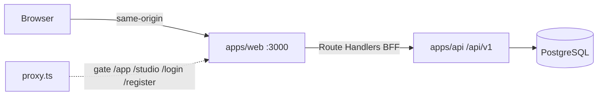

# US-AS0 — Autenticação e modelo de usuário

**Produto:** Zenith  
**Origem:** [docs/sdd.md](../../docs/sdd.md) (JWT, `User`, DTOs). História de sistema; entra no PRD nesta entrega.  
**Fora do PRD original:** não havia história de auth; esta spec fecha o gap.

---

## 1. História

Como visitante, eu quero me cadastrar e entrar com e-mail e senha escolhendo o papel (`CLIENT` ou `TRAINER`), para acessar só a interface do meu papel (`/app` ou `/studio`) com sessão em cookie `httpOnly`.

**Por quê:** o restante do produto (aluno e treinador) depende de identidade, papel e sessão. Sem isso, `/app` e `/studio` não existem como áreas isoladas.

---

## 2. Escopo

Inclui:

- Modelo `User` no PostgreSQL via Prisma (campos do SDD).
- API NestJS de registro, login, refresh, logout e `/me`.
- BFF no Next.js (`app/api/v1/auth/*`) que traduz tokens do Nest em cookies `httpOnly`.
- `proxy.ts` protegendo `/app` e `/studio` e redirecionando por papel.
- Telas `/login` e `/register`; placeholders autenticados em `/app` e `/studio`.
- Inclusão de `US-AS0` no PRD e atualização do SDD (BFF, cookies, refresh, `proxy.ts`).

Fora de escopo:

- Convite de aluno pelo treinador; `TRAINER` via seed/admin.
- Denylist / rotação persistida de refresh no banco.
- CSRF token extra (mitigação desta história: `SameSite=Lax` + same-origin).
- OAuth, 2FA, recuperação de senha, verificação de e-mail.
- White label, chat, tracker calórico.
- E2E Playwright.
- O browser **não** chama o NestJS direto.

---

## 3. Arquitetura

O browser fala só com `apps/web` (origem `:3000`). O NestJS em `apps/api` (`:3001`, prefixo `/api/v1`) é a fonte da verdade: persiste `User`, hasheia senha, emite JWT. Os Route Handlers do App Router chamam o Nest, gravam cookies e devolvem só o usuário. `proxy.ts` faz gate otimista; o `JwtAuthGuard` do Nest autoriza de verdade.



Isolamento por papel (inalterado no SDD):

- `/app` — aluno (`CLIENT`)
- `/studio` — treinador (`TRAINER`)

`/` redireciona: sem sessão → `/login`; com sessão → área do papel.

---

## 4. Modelo de dados

Prisma, fiel ao ER do SDD:

```prisma
enum Role {
  TRAINER
  CLIENT
}

model User {
  id           String   @id @default(uuid())
  email        String   @unique
  passwordHash String
  name         String
  role         Role
  createdAt    DateTime @default(now())
}
```

Regras:

- `email` único, persistido em minúsculas, sem espaços nas pontas.
- `passwordHash` é bcrypt (custo 10). A senha crua nunca é persistida nem devolvida.
- `role` só `TRAINER` | `CLIENT`, escolhido no cadastro.

---

## 5. Contratos

### 5.1 Validação (Nest, `class-validator`)

| Campo | Regra |
| --- | --- |
| `name` | string, 2–100 caracteres, trim |
| `email` | e-mail válido, trim, lowercase |
| `password` | 8–72 caracteres (teto do bcrypt) |
| `role` | exatamente `TRAINER` ou `CLIENT` |

`LoginDto` valida só `email` e `password` com as mesmas regras de formato (sem exigir `role`).

### 5.2 NestJS — chamado apenas pelo BFF

Prefixo global: `/api/v1`.

DTOs de entrada (já no SDD):

```ts
export class RegisterUserDto {
  name: string;
  email: string;
  password: string;
  role: 'TRAINER' | 'CLIENT';
}

export class LoginDto {
  email: string;
  password: string;
}

export class RefreshTokenDto {
  refreshToken: string;
}
```

Resposta de registro/login (substitui `AuthTokenResponseDto` só-access no SDD):

```ts
export class AuthSessionResponseDto {
  user: UserResponseDto;
  accessToken: string;
  refreshToken: string;
}

export class UserResponseDto {
  id: string;
  name: string;
  email: string;
  role: 'TRAINER' | 'CLIENT';
  createdAt: string; // ISO 8601
}
```

`UserResponseDto` **nunca** inclui `passwordHash` nem tokens.

| Método | Rota | Auth | Entrada | Sucesso |
| --- | --- | --- | --- | --- |
| `POST` | `/auth/register` | público | `RegisterUserDto` | `201` `AuthSessionResponseDto` |
| `POST` | `/auth/login` | público | `LoginDto` | `200` `AuthSessionResponseDto` |
| `POST` | `/auth/refresh` | público* | `RefreshTokenDto` | `200` `{ accessToken, refreshToken }` |
| `GET` | `/auth/me` | Bearer access | — | `200` `UserResponseDto` |
| `POST` | `/auth/logout` | público | — | `204` vazio |

\* `/auth/refresh` é “público” na rede, mas exige refresh JWT válido no body. Sem denylist: logout no Nest é no-op `204`; o BFF apaga cookies.

JWT:

- Access: secret `JWT_ACCESS_SECRET`, expira `15m`, payload `{ sub, email, role, type: 'access' }`.
- Refresh: secret `JWT_REFRESH_SECRET`, expira `7d`, payload `{ sub, email, role, type: 'refresh' }`.
- Access usado como refresh (ou o inverso) → `401`.
- Refresh válido emite **par novo** (access + refresh). Não há persistência do refresh no banco nesta história.

### 5.3 BFF Next.js — chamado pelo browser

Route Handlers em `apps/web/app/api/v1/auth/{register,login,refresh,logout,me}/route.ts`.  
Base do Nest: `API_URL` (dev: `http://localhost:3001`).

O browser **nunca** recebe `accessToken` nem `refreshToken` em JSON.

| Método | Rota pública (web) | Comportamento |
| --- | --- | --- |
| `POST` | `/api/v1/auth/register` | Encaminha ao Nest; em `201` seta cookies e devolve `UserResponseDto` |
| `POST` | `/api/v1/auth/login` | Idem; sucesso `200` + cookies + `UserResponseDto` |
| `POST` | `/api/v1/auth/refresh` | Lê `zenith_refresh`; Nest ok → novos cookies `200`; senão limpa cookies `401` |
| `GET` | `/api/v1/auth/me` | Bearer a partir de `zenith_access`. Se Nest `401` e houver refresh, tenta refresh **uma** vez e repete `/me`. Falha → limpa cookies, `401` |
| `POST` | `/api/v1/auth/logout` | Sempre apaga os cookies (`Max-Age=0`) e responde `204`, mesmo se o Nest falhar; o `POST` ao Nest é best-effort |

Erros do Nest (`400`, `401`, `409`) são reencaminhados com o mesmo status e corpo ao browser, **sem** setar cookies.

### 5.4 Cookies

| Nome | Conteúdo | Atributos |
| --- | --- | --- |
| `zenith_access` | JWT access | `HttpOnly`, `SameSite=Lax`, `Path=/`, `Max-Age=900`, `Secure` só em produção |
| `zenith_refresh` | JWT refresh | idem, `Max-Age=604800` (7 dias) |

`Path=/` nos dois para o `proxy.ts` ver a sessão em `/app` e `/studio`.  
Em desenvolvimento (`http://localhost`) **não** usar `Secure` (cookie não seria gravado).

---

## 6. UI e `proxy.ts`

Páginas:

- `/register` — nome, e-mail, senha, escolha **obrigatória** de papel (`CLIENT` ou `TRAINER`, sem default). Submit `POST /api/v1/auth/register`. Sucesso: `CLIENT` → `/app`, `TRAINER` → `/studio`.
- `/login` — e-mail, senha, submit `POST /api/v1/auth/login`. Mesmo redirect.
- `/app` — placeholder da área do aluno (nome do usuário + logout).
- `/studio` — placeholder da área do treinador (nome + logout).
- Logout: `POST /api/v1/auth/logout` e redirect `/login`.

`proxy.ts` (Next.js 16, sucessor do `middleware.ts`) — check **otimista**. Lê `role` do payload JWT (segmento do meio, JSON), **sem** verificar assinatura. Prefere `zenith_access`; se ausente, usa `zenith_refresh`. Assinatura e `exp` são responsabilidade do Nest / BFF `/me`.

Matcher: `/`, `/login`, `/register`, `/app/:path*`, `/studio/:path*`.

| Situação | Ação |
| --- | --- |
| Sem `zenith_access` e sem `zenith_refresh` em `/`, `/app`, `/studio` | Redirect `/login` |
| Sessão presente em `/login` ou `/register` e `role` legível no access (ou refresh) | Redirect `/app` ou `/studio` conforme `role` |
| `CLIENT` acessando `/studio` | Redirect `/app` |
| `TRAINER` acessando `/app` | Redirect `/studio` |
| Só refresh (access expirado/ausente) em `/app` ou `/studio` | Deixa passar; o layout chama `GET /api/v1/auth/me` (BFF faz refresh) |
| `/` com sessão e `role` | Redirect área do papel |

O proxy **não** substitui o `JwtAuthGuard`. Autorização de dados é sempre no Nest.

---

## 7. Fluxos

**Registro / login**

1. Form posta JSON same-origin no BFF.
2. BFF chama Nest.
3. Nest valida, persiste (registro) ou compara bcrypt (login), devolve `user` + tokens.
4. BFF seta os dois cookies e responde só `UserResponseDto`.
5. Cliente navega para `/app` ou `/studio`.

**Navegação**

1. `proxy.ts` lê cookies e aplica a tabela da seção 6.
2. Layout de `/app` e `/studio` chama `GET /api/v1/auth/me` para renderizar o usuário.

**Refresh silencioso**

1. `/me` no BFF recebe `401` do Nest e existe `zenith_refresh`.
2. BFF `POST` Nest `/auth/refresh`.
3. Sucesso: novos cookies e retry de `/me` uma vez.
4. Falha: cookies apagados, `401`; o próximo document request cai no proxy → `/login`.

**Logout**

1. BFF apaga os cookies (`Max-Age=0`) e tenta `POST` Nest `/auth/logout`.
2. Redirect `/login`.

---

## 8. Erros

Mesmos códigos no Nest e no BFF (BFF replica status + body):

| Status | Quando | Corpo |
| --- | --- | --- |
| `400` | Validação (e-mail inválido, senha &lt; 8, `role` inválido, campos faltando) | mensagens de campo (`class-validator` / equivalente) |
| `401` | Login errado, Bearer ausente/inválido, refresh inválido/expirado | `{ "statusCode": 401, "message": "Unauthorized" }` — **não** distinguir e-mail inexistente vs senha errada |
| `409` | `POST /auth/register` com e-mail já cadastrado | `{ "statusCode": 409, "message": "Email already registered" }` |
| `403` | Não usado no Nest nesta história; papel cruzado é redirect no proxy | — |
| `204` | Logout | vazio |

Telas: `400`/`401`/`409` aparecem como erro no form, sem stack nem payload interno.

---

## 9. Configuração

Acrescentar a `.env.example` (e `.env` local):

```
JWT_ACCESS_SECRET=
JWT_REFRESH_SECRET=
JWT_ACCESS_EXPIRES_IN=15m
JWT_REFRESH_EXPIRES_IN=7d
API_URL=http://localhost:3001
```

`JWT_*` são lidos pela API. `API_URL` é lido pelo web (BFF → Nest). Secrets de JWT **não** têm default inseguro em produção; em teste, secrets fixos só nos `*.spec.ts` / env de CI.

`apps/web` precisa de `API_URL` no runtime do servidor (Route Handlers), não no bundle do cliente.

---

## 10. Testes (TDD, Jest)

### API (`apps/api`)

- Registro persiste `User` com `passwordHash` ≠ senha crua e responde `201` com `user` + tokens.
- `UserResponseDto` não contém `passwordHash`.
- E-mail duplicado → `409`.
- Senha &lt; 8 ou `role` inválido → `400`.
- Login válido → `200` + tokens; e-mail ou senha errados → `401`.
- `GET /auth/me` sem Bearer → `401`; com access válido → usuário.
- Access no endpoint de refresh (ou refresh no `/me`) → `401`.
- Refresh válido → novo par de tokens; inválido → `401`.

### Web (`apps/web`)

- `/login` e `/register` renderizam campos exigidos (incluindo escolha de papel no registro).
- Route Handler de login/registro: Nest `200`/`201` → `Set-Cookie` `HttpOnly` para os dois cookies e body sem tokens; Nest `401`/`409` → mesmo status, sem `Set-Cookie` de sessão.
- `proxy.ts`: sem cookies em `/app` → redirect `/login`; `CLIENT` em `/studio` → `/app`; sessão `TRAINER` em `/login` → `/studio`.

CI existente (`lint` + `test` em api e web) deve permanecer verde.

---

## 11. Critérios de aceite

1. Visitante cadastra com nome, e-mail, senha (≥ 8) e papel; a linha em `User` tem hash bcrypt, não a senha crua.
2. Login com credencial válida grava `zenith_access` e `zenith_refresh` `HttpOnly`; o JSON da resposta **não** traz os JWT; `document.cookie` no cliente **não** lista esses nomes.
3. `CLIENT` autenticado cai em `/app`; `TRAINER` em `/studio`; cruzar área redireciona para a área do papel.
4. Não autenticado em `/app` ou `/studio` vai para `/login`.
5. Logout zera os cookies e a próxima visita a `/app` vai para `/login`.
6. Access expirado com refresh válido: `GET /api/v1/auth/me` no BFF renova cookies e devolve o usuário (sem o visitante relogar).
7. E-mail duplicado → `409`; login inválido → `401` genérico.
8. PRD contém `US-AS0`; SDD documenta BFF, cookies `httpOnly`, refresh e `proxy.ts`.
9. `npm test` e lint em `apps/api` e `apps/web` passam no CI.

---

## 12. Trabalho de documentação na implementação

Não nesta spec (já escrita), e sim no plano/código:

- `docs/prd.md` — seção **3.0 Histórias de sistema** com `US-AS0` (texto da seção 1).
- `docs/sdd.md` — diagrama browser → Next BFF → Nest; DTOs de sessão/refresh; cookies; `proxy.ts`; nota de que o browser não chama `:3001`.
